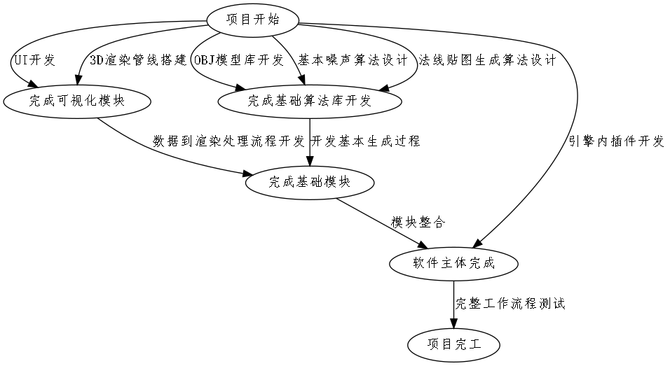
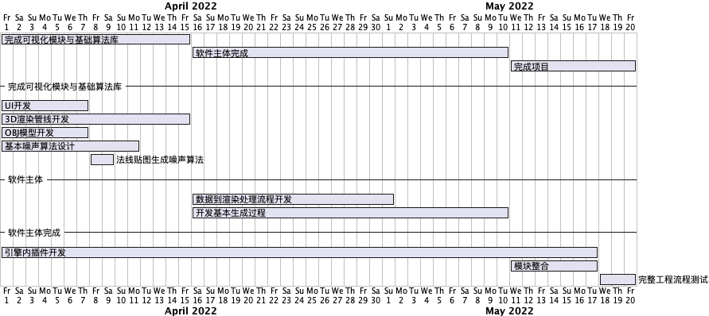

# World Generator Lit

#### 介绍

World Generator Lit是一个基于PCG的过程化开源地形生成器，属于游戏开发过程中的应用工具。在游戏开发或影视特效制作的过程中，往往有地形生成费时、不能重复使用等问题，大大增加了游戏或影视制作相关人员的工作量。本项目旨在通过程序自动生成地形，以此简化相关从业人员在开发制作过程中地形的创建及编辑的工作。
生成器通过使用一系列PCG算法，如：柏林噪声算法、二插值、分形噪声算法，实现游戏中地形及植被的生成，包括但不限于纹理的生成，地形生成之后可以通过插件或脚本导入到unity3D、unreal engine等3维游戏引擎中，成为高复用、跨平台的面向细节的游戏地形。

#### 软件架构

软件架构说明，暂无

#### 项目开发活动流程

#### 项目进度

[项目进度](./tasks.md)

#### 安装教程

敬请期待

#### 使用说明

敬请期待

#### 参与贡献

暂无
